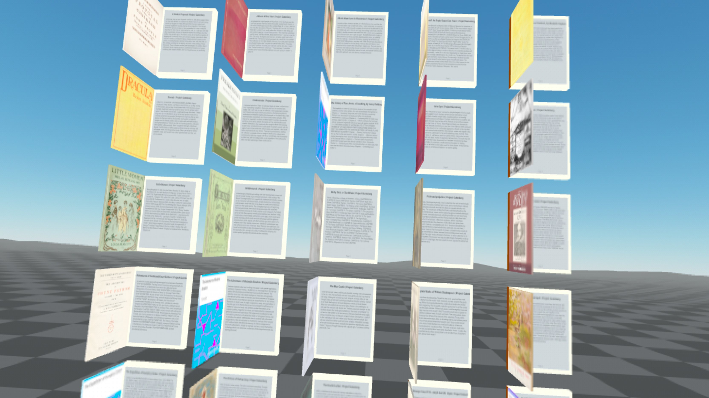

# XR Books

Experience your favorite ebooks in immersive XR. Browse our free public domain library or upload your own books. Works directly in your browser—no downloads required.

## Demo Video

<!--  -->
<video src="./assets/github/demo.mov"></video>

## Screenshots

| Library View | Book Selection | Reading in VR | Page Turning |
|--------------|---------------|---------------|-------------|
|  |  |  |  |

## Features

- **Immersive Reading**: Read ebooks in a virtual reality environment
- **Public Domain Library**: Access a curated collection of classic literature
- **Custom Books**: Upload and read your own EPUB files
- **VR Interactions**: Grab, move, and interact with books using VR controllers
- **Cross-Platform**: Works on any WebXR-compatible browser and VR headset

## System Requirements

- **Browser**: Chrome, Firefox, or Edge with WebXR support enabled
- **VR Hardware**: Any WebXR-compatible VR headset (Oculus Quest, HTC Vive, etc.)
- **Internet Connection**: Required for initial loading (books are cached locally)

## Getting Started

1. Open the app in a WebXR-compatible browser
2. Put on your VR headset
3. Browse the library or upload your own EPUB files
4. Grab books with your controllers and start reading!

## Controls

- **Trigger**: Grab/Release books
- **Grip**: (Additional interactions)
- **Thumbstick**: Navigate and turn pages
